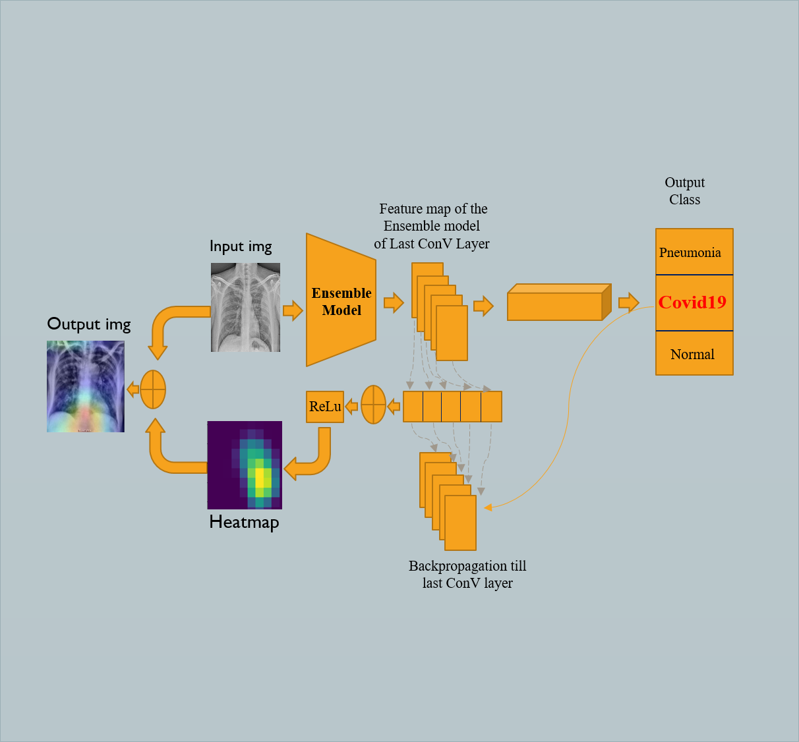

# GRAD-CAM
 1) Wewill create a model (which behaves as a function) that takes as input an image (model.inputs) and outputs a list of the output of the model and the output of the final convolutional layer ([model.output, last_conv_layer.output]) for later use.
 2) Find the index of the winning class in the model output.

It is a visualization technique that helps to understand which features a CNN is looking for when it classifies an image by producing a heat map that highlights the important regions of an image using the class specific gradient information flowing from final convolutional layer for each image. 

   
  <i>GAN over the years.</i>

## Author
+ Name: Md. Shahin Alom
+ 𝐏𝐡𝐨𝐧𝐞:   (+880) 1704801703(Whatsapp)
+ 𝘔𝘢𝘪𝘭:     ashahin200@gmail.com
+ LinkedIn: http://linkedin.com/in/ashahin200